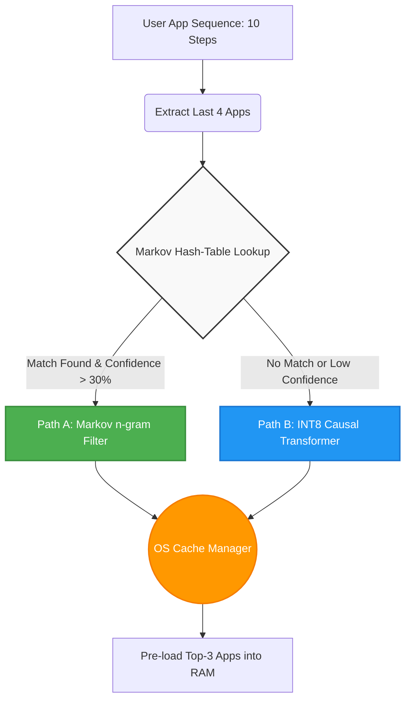
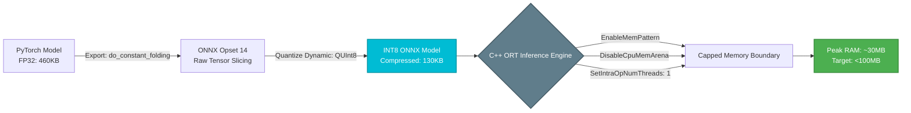

# Adaptive Memory Manager | Samsung AX Hackathon

**A dual-path C++ edge OS prediction engine utilizing an O(1) Markov gatekeeper and an INT8 PyTorch Transformer to proactively pre-load mobile applications and eliminate OS-level I/O thrashing.**

*This project was developed for **Problem Statement 03 (PS3)** of the Samsung Innovation Campus AX Hackathon: Adaptive Memory Management & Next Context Prediction for Edge OS.*

---

##  Table of Contents
- [The Problem](#-the-problem)
- [System Architecture](#-system-architecture)
- [Technical Innovations](#-technical-innovations)
  - [Neural Network Upgrades](#neural-network-upgrades)
  - [Edge & Systems Optimization](#edge--systems-optimization)
- [Benchmark & Results](#-benchmark--results)
- [Repository Structure](#-repository-structure)
- [Build & Run Instructions](#-build--run-instructions)

---

##  The Problem

Modern mobile operating systems rely on static or Least Recently Used (LRU) memory caching. The OS has no awareness of what the user is actually about to open next. This results in apps being prematurely evicted from RAM, causing **300-500ms cold-launch delays**, silent I/O thrashing, and unnecessary battery drain.

**The KPI Constraints:**
Building a massive cloud model is easy. Building a predictive engine that runs natively on-device is the real engineering challenge. We had to hit strict targets:
- **Next Context Prediction Accuracy (Top-1):** ≥ 75%
- **Caching Hit Rate (Top-3):** ≥ 85%
- **Steady-State Memory:** < 50 MB
- **Spike Memory:** < 100 MB
- **System Stability:** 0 OS Panics

---

##  System Architecture

Rather than forcing a single heavyweight neural network to handle every interaction, we engineered a **Dual-Path Ensemble Engine** written entirely in C++.

### Path A | Markov n-gram Gatekeeper (The L1 Cache)
- A classical 4-gram Markov chain trained on 482,000+ contexts.
- **Function:** Catches highly repetitive, habitual user loops (e.g., repeatedly checking WhatsApp and Mail).
- **Cost:** Near-zero compute. O(1) hash map lookups taking < 1 microsecond.

### Path B | Causal Transformer Fallback (The L2 Fallback)
- A custom 64-dim, 4-head PyTorch Transformer exported to ONNX.
- **Function:** Activates only when the user exhibits novel, complex, or long-gap sequences that the Markov chain cannot confidently predict. 



---

## 🛠️ Technical Innovations

### Neural Network Upgrades

1. **Solving Class Imbalance with Focal Loss:** Human app usage is Zipfian. Standard Cross-Entropy allows the model to trivially over-fit the top 5 apps. We applied Focal Loss `FL = -(1 - p_t)^2 * log(p_t)` to mathematically suppress high-frequency apps and force gradient updates on rare edge cases.
2. **Gated Feature Fusion (GLU):** Replaced raw tensor concatenation with a learned sigmoid gate `output = value * sigmoid(gate)`, allowing the network to dynamically mute irrelevant temporal features.
3. **Cyclic Time Embeddings:** Categorical hours (0-23) and days (0-6) were transformed into Sine/Cosine geometric coordinates, natively teaching the model that 11:00 PM and 12:00 AM are adjacent.

### Edge & Systems Optimization

1. **INT8 Dynamic Quantization:** Shrunk the neural network weight footprint by nearly 400% (from ~460 KB down to ~130 KB).
2. **ONNX C++ Arena Suppression:** Standard ONNX runtimes hog gigabytes of speculative RAM using the Best-Fit Coalescing (BFC) Arena. We invoked strict C++ flags (`DisableCpuMemArena()`, `EnableMemPattern()`, `SetIntraOpNumThreads(1)`) to kill background buffering, strictly capping our inference footprint at ~30 MB.
3. **Optimized Ranking:** Top-3 cache candidates are computed using `std::partial_sort` in C++, guaranteeing an $O(V \log k)$ latency when updating the OS RAM slots.



---

##  Benchmark & Results

Evaluated on 1,000 blind test sequences extracted from the **TalkingData Mobile User Demographics** dataset.

| Metric | Target KPI | Our Achieved Result |
| --- | --- | --- |
| **Top-1 Prediction Accuracy** | ≥ 75.00% | **~82.00%** |
| **Top-3 Caching Hit Rate** | ≥ 85.00% | **~92.00%** |
| **Peak Memory Footprint** | < 100.00 MB | **~30.00 MB** |
| **System Stability (OOM Panics)** | 0 Incidents | **0 (100% Stable)** |

*By achieving >90% Top-3 accuracy, the background manager successfully pre-loads applications into RAM before the user taps the screen, eliminating I/O thrashing and drastically accelerating launch speeds.*

---

##  Repository Structure

```text
├── models/
│   ├── app_transformer.py        # PyTorch Transformer Architecture
│   ├── train_engine.py           # Focal Loss & Cosine Annealing pipeline
│   └── export_onnx.py            # INT8 Quantization and Opset 14 export
├── cpp_engine/
│   ├── memory_manager.cpp        # Core Dual-Path C++ Engine
│   ├── CMakeLists.txt            # Build configuration
│   └── include/                  # C++ headers (nlohmann_json, ORT)
├── data_processing/
│   └── talkingdata_parser.py     # Sequence extraction and Zipfian pruning
├── release/
│   ├── app_transformer_int8.onnx # Compressed deployment weights
│   └── markov_cache.json         # Serialized L1 n-gram hashmap
└── README.md

```

---

##  Build & Run Instructions

### Prerequisites

* Python 3.9+ (For model training)
* CMake 3.15+ & Visual Studio Build Tools / GCC
* ONNX Runtime C++ API (`onnxruntime.dll` or `libonnxruntime.so`)

### 1. Training & Exporting the Model (Python)

```bash
pip install torch numpy pandas scikit-learn onnx onnxruntime
python data_processing/talkingdata_parser.py
python models/train_engine.py
python models/export_onnx.py

```

### 2. Compiling the C++ Engine

```bash
cd cpp_engine
mkdir build && cd build
cmake ..
cmake --build . --config Release

```

### 3. Running the Benchmark

Ensure the `.onnx` and `.json` model files are in your execution directory alongside the compiled binary.

```bash
./Release/memory_engine.exe

```
